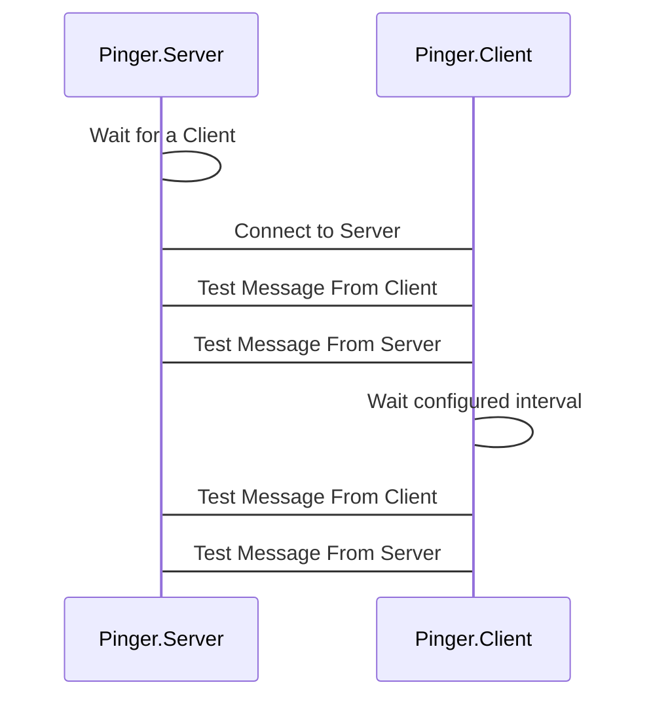

# Pinger
A Software containing example TCP Client and Server for testing connection between machines.

## How it works
To use this app properly you should execute *Pinger.Server* on the machine that is supposed to be a communication Server
and execute *Pinger.Client* on the machine that is supposed to be a communication Client.

*Ping.Server* supports parallel communication with several *Ping.Client*s.

Every configured interval, *Pinger.Client* sends a dummy request to the *Ping.Server*.
When *Pinger.Server* gets such request, it responds to the *Pinger.Client* with another dummy request.



## Usage
You can configure parameters invoked by this application in two ways:
 - By editing parameters in *appsettings.json*.
 - By specificing arguments in *CMD*.

### Usage of Server

To invoke a Server simply execute the exe file of *Pinger.Server*:

```ps
.\Pinger.Server.exe 
```

This way config parameters from *appsettings.json* will be used.

If you want to overwritte these configurations edit this file or specify them as arguments in CMD in the correct order:

```ps
.\Pinger.Server.exe 58002 127.0.0.1 TCP
```

where arguments are:
- port on which the server will be listening
- ip addresses on which server will be listening. In case of providing *0.0.0.0* all ip addresses will be accepted.
- protocol used for communication. Right now only TCP is supported.

### Usage of Client

To invoke a Client simply execute the exe file of *Pinger.Client.exe*:

```ps
.\Pinger.Client.exe 
```

This way config parameters from *appsettings.json* will be used.

If you want to overwritte these configurations edit this file or specify them as arguments in CMD in the correct order:

```ps
.\Pinger.Client.exe 127.0.0.1:58002 1000 TCP
```

where arguments are:
- ip address and port on which the server is running
- time in miliseconds between sending requests by the client to the server.
- protocol used for communication. Right now only TCP is supported.
